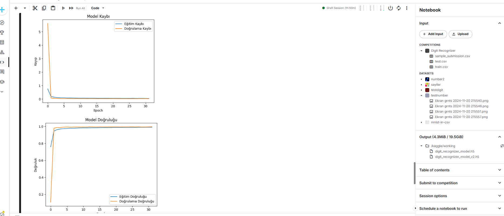

### **1-Proje Amacı**
>Bu çalışmada, el yazısı ile yazılmış rakamları sınıflandırmak amacıyla bir Derin Öğrenme modeli geliştirilmiştir. Amaç, Kaggle'da bulunan "Digit Recognizer" veri setini kullanarak, Convolutional Neural Network (CNN) temelli bir model ile rakamların doğru bir şekilde sınıflandırılmasını sağlamaktır. Model, veri artırma teknikleriyle eğitilmiş ve test verileri üzerinde performansı değerlendirilmiştir. 

### **2-Digit Recognizer Veriseti**
>Digit Recognizer veri seti, el yazısıyla yazılmış 0 ile 9 arasıdaki rakamların sınıflandırılmış, Kaggle üzerinde bulunan bir veri setidir. MNIST veri setine benzer bir yapıdadır. Veri seti, eğitim için 42.000 örnek, test için ise 28.000 örnek veri bulunmaktadır. Görseller 28x28 piksel boyutunda, siyah-beyaz formatta sunulmaktadır. Her pikselin yoğunluğu 0 ile 255 arasında değer alırken, eğitim verisinde her görselin hangi rakamı temsil ettiğini belirten bir "label" sütunu yer almaktadır. Test verisinde ise bu etiket bilgisi bulunmamakta ve modelin performansı bu veri üzerindeki tahmin doğruluğuyla değerlendirilmektedir. Eğitim sürecinde veriseti, piksel değerlerinin 0-255 aralığından 0-1 aralığına normalize edilmesi, görüntülerin CNN girişine uygun olarak `(28, 28, 1)` boyutuna dönüştürülmesiyle işlenmiştir. Ayrıca, eğitim verisi %80 eğitim ve %20 doğrulama olarak ikiye ayrılmıştır. Bu veri seti, optik karakter tanıma (OCR), görsel sınıflandırma çalışmaları ve derin öğrenme modellerinin performansını test etme gibi pek çok uygulama alanında kullanılabilir.


### **3-Model Mimarisi**
#### **Convolutional Neural Network (CNN)**
>Convolutional Neural Network (CNN), özellikle görüntü ve ses gibi grid benzeri verileri işlemek için tasarlanmış bir derin öğrenme modelidir. CNN'ler, insan görsel korteksinin çalışma prensiplerinden esinlenerek geliştirilmiştir ve temel olarak üç ana katmandan oluşur:
1. **Evrişim (Convolutional) Katmanı**: Bu katman, giriş verisi üzerinde belirli filtreler (kernels) kullanarak özellik haritaları oluşturur. Her filtre, giriş verisindeki belirli özellikleri (örneğin, kenarlar, dokular) tespit etmek üzere eğitilir. Bu sayede, modelin verideki önemli özellikleri öğrenmesi sağlanır.
    
2. **Havuzlama (Pooling) Katmanı**: Evrişim katmanından elde edilen özellik haritalarının boyutunu azaltmak ve hesaplama maliyetini düşürmek için kullanılır. En yaygın kullanılan havuzlama yöntemi, belirli bir bölgedeki en yüksek değeri seçen Maksimum Havuzlama'dır (Max Pooling). Bu işlem, modelin önemli özellikleri koruyarak daha küçük boyutlu veriyle çalışmasını sağlar.
    
3. **Tam Bağlantılı (Fully Connected) Katman**: Havuzlama katmanlarından gelen veriler, düzleştirilerek (flatten) tam bağlantılı katmanlara aktarılır. Bu katmanlar, gelen veriyi sınıflandırmak veya belirli bir çıktıyı tahmin etmek için kullanılır. Son katmanda genellikle softmax veya sigmoid gibi aktivasyon fonksiyonları kullanılarak, modelin olasılık dağılımı üretmesi sağlanır.
    
>CNN'ler, görüntü sınıflandırma, nesne tespiti ve yüz tanıma gibi birçok alanda başarılı bir şekilde uygulanmaktadır.

```Python
model = Sequential([
    # İlk evrişim bloğu
    Conv2D(32, (3, 3), activation='relu', input_shape=(28, 28, 1)),
    BatchNormalization(),  # Batch Normalization ekleme
    Conv2D(32, (3, 3), activation='relu'),
    BatchNormalization(),
    MaxPooling2D((2, 2)),
    Dropout(0.25),

    # İkinci evrişim bloğu
    Conv2D(64, (3, 3), activation='relu'),
    BatchNormalization(),
    Conv2D(64, (3, 3), activation='relu'),
    BatchNormalization(),
    MaxPooling2D((2, 2)),
    Dropout(0.25),

    # Üçüncü evrişim bloğu
    Conv2D(128, (3, 3), activation='relu'),
    BatchNormalization(),
    MaxPooling2D((2, 2)),
    Dropout(0.4),

    # Tam bağlantılı (Dense) katmanlar
    Flatten(),
    Dense(256, activation='relu'),
    Dropout(0.5),
    Dense(10, activation='softmax')  # 10 sınıf için softmax
])

model.compile(optimizer='adam', loss='categorical_crossentropy', metrics=['accuracy'])

history = model.fit(
    datagen.flow(X_train, y_train, batch_size=128),
    epochs=32,
    validation_data=(X_val, y_val)
)
```

>Bu modelde kullanılan **Convolutional Neural Network (CNN)** mimarisi yukarıda verilmiştir. Model, toplamda üç evrişim bloğu ve tam bağlantılı (Dense) katmanlardan oluşmaktadır. İlk evrişim bloğunda her biri `(3, 3)` boyutunda filtrelere sahip ve giriş boyutu `(28, 28, 1)` olarak belirtilmiştir. Batch Normalization, evrişim katmanlarından sonra, öğrenme hızını artırmak ve modelin daha kararlı hale gelmesini sağlamak için kullanılmıştır. MaxPooling, Görüntü boyutunu yarıya indiren `(2, 2)` boyutunda bir MaxPooling katmanı eklenmiş olup önemli özellikleri koruyarak gereksiz bilgileri filtreler.Dropout, İlk evrişim bloğunun sonunda, aşırı öğrenmeyi önlemek amacıyla kullanılmıştır. İkinci ve Üçüncü evrişim bloğu farklı olarak sırasıyla 64,128 filtreye sahip ilk katmana benzer yapıdadır. Tam Bağlantılı (Dense) Katmanda ise 256 ve 10 adet nöron bulunur. Flattten üçüncü evrişim bloğundan çıkan özellik haritaları, tam bağlantılı katmanlara aktarılmadan önce düzleştirilir. Çıkış nöronunda softmax kullanılmıştır. Bu da sınıf olasılıklarını verir.
#### **Modelin Derlenmesi**
Model derlenme parametreleri:
- **Optimizasyon Algoritması:** Adam optimizasyon algoritması, hızlı ve kararlı bir öğrenme süreci sağlar.
- **Kayıp Fonksiyonu:** `categorical_crossentropy` kayıp fonksiyonu, çok sınıflı sınıflandırma problemleri için uygundur.
- **Değerlendirme Metrikleri:** Modelin doğruluğu (`accuracy`) temel performans ölçütü olarak seçilmiştir.
#### **Modelin Eğitimi**
- **Veri Artırma:** `ImageDataGenerator` ile artırılmış veri, modelin genelleme yeteneğini artırmıştır. Eğitim sırasında veri döndürme, kaydırma ve yakınlaştırma gibi işlemler uygulanmıştır.
- **Epoch:** Bir epoch, eğitim veri setinin model tarafından baştan sona bir kez işlenmesi anlamına gelir. Model 32 epoch boyunca eğitilmiştir.
- **Batch Size:** Eğitim veri setinin küçük parçalar halinde işlenmesini sağlar. Her bir adımda 128 görüntü işlenmiştir.
- **Doğrulama Verisi:** Her epoch sonunda modelin doğrulama kaybı (`val_loss`) ve doğrulama doğruluğu (`val_accuracy`) değerleri hesaplanır. Bu da eğitim sırasında modelin doğrulama verisi üzerindeki doğruluğunu ölçmek ve aşırı öğrenmeyi izlemektir .

### **4-Modelin Test Süreci ve Performans Analizi 

>Modelin test sürecinde, Kaggle veri setine ek olarak harici test kaynakları da kullanılarak model test edilmiş. Eğitim ve doğrulama aşamalarında modelin performansını analiz etmek için **Model Kaybı (Loss)** ve **Model Doğruluk (Accuracy)** grafikleri oluşturulmuştur. Ayrıca, modelin test verileri üzerindeki tahminlerini görselleştirmek için örnek görseller sunulmuştur.




